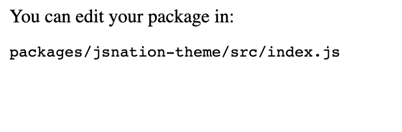
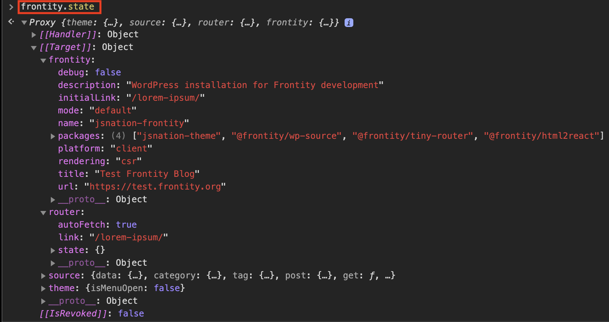
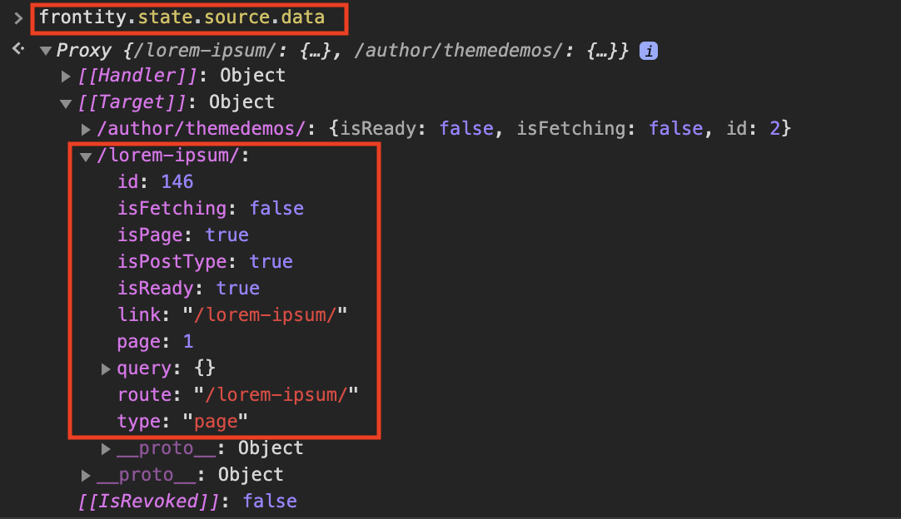
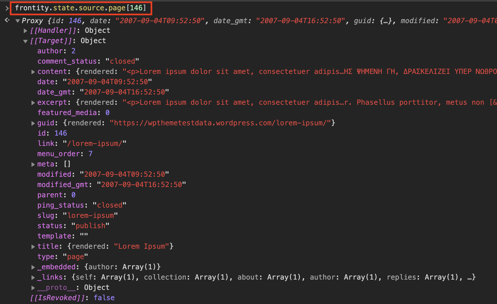
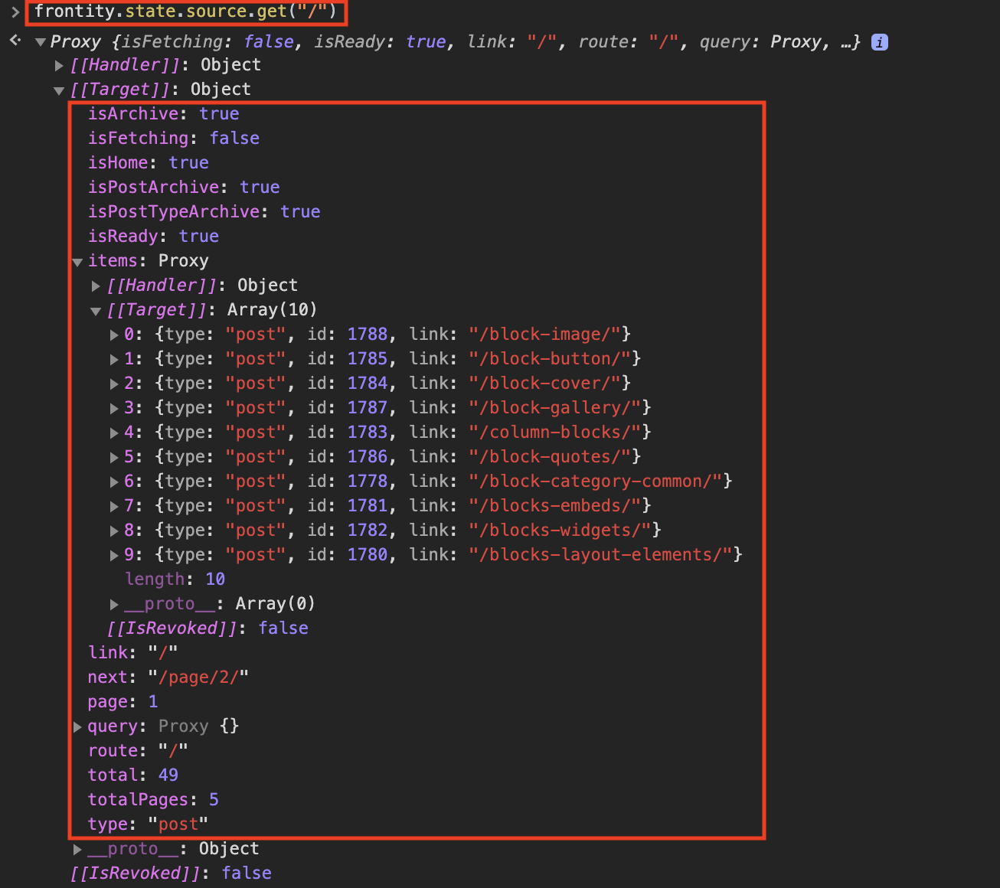
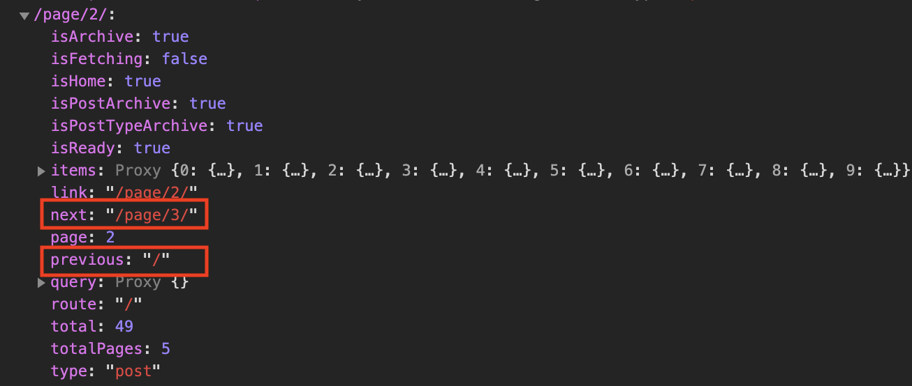
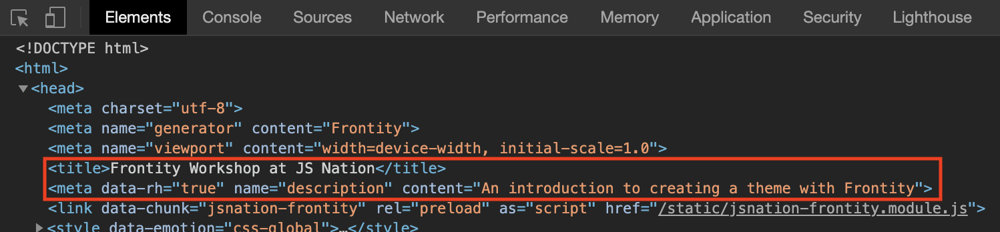

# Build a React-based Theme for WordPress with Frontity

This repo contains the complete theme created for 'Build a React-based Theme for WordPress with Frontity', a workshop/webinar held on 15 June 2020 at the [JS Nation Live conference](https://live.jsnation.com/).

This readme also contains full instructions for creating the project from scratch.

## Table of Contents

1. [Create a Frontity Project](#1-create-a-Frontity-Project)
2. [Create a custom theme from scratch](#2-create-a-custom-theme-from-scratch)
3. [Modify the first component](#3-modify-the-first-component)
4. [Connect it to the state](#4-connect-it-to-the-state)
5. [Add a menu](#5-add-a-menu)
6. [Use data from the current URL](#6-use-data-from-the-current-URL)
7. [Display the list of posts](#7-display-the-list-of-posts)
8. [Display the content of posts](#8-display-the-content-of-posts)
9. [Display the content of posts and pages separately](#9-display-the-content-of-posts-and-pages-separately)
10. [Add some style](#10-add-some-style)
11. [Add dynamic styling](#11-add-dynamic-styling)
12. [Use state and actions](#12-use-state-and-actions)
13. [Add pagination](#13-add-pagination)
14. [Add tags to the `<head>` element](#14-add-tags-to-the-head-element)
15. [Conclusion](#15-conclusion)
16. [Frontity Channels](#16-frontity-channels)

## 1. Create a Frontity Project

The first thing we are going to do is create a new Frontity project.

To do so, open up your terminal, navigate to the folder where you want to install your new project, and run this command:

```bash
npx frontity create jsnation-frontity
```

When the install process finishes, you will have a new sub-folder called `jsnation-frontity` containing your project’s code.

Start a development server to check that everything is working:

```bash
cd jsnation-frontity
npx frontity dev
```

> `npx` downloads an npm package to run just this one time and then removes it from your computer. [learn more](https://medium.com/@maybekatz/introducing-npx-an-npm-package-runner-55f7d4bd282b)

Now open `http://localhost:3000` in your browser (if it didn't open automatically) to see your first Frontity project. At the moment it's using the "starter theme" that comes with Frontity, i.e. @frontity/mars-theme, and it is connected to a test WordPress site (https://test.frontity.io).

The next step is to change the project’s settings to point to the REST API of our own website (https://jsnation2020.frontity.org).

- Open the file `frontity.settings.js` file. This file contains the configuration for the Frontity packages that you are using in your project.

- Change the value of the `api` field of the `@frontity/wp-source package`.

Replace this:
```js
state: {
  source: {
    api: "https://test.frontity.io/wp-json"
  }
}
```
With this:
```js
state: {
  source: {
    api: "https://jsnation2020.frontity.org/wp-json"
  }
}
```
Refresh the page in the browser to see all the posts on the website. What you can see now is content generated by the [WordPress Theme Unit Test](https://github.com/WPTT/theme-unit-test). This provides a set of typical content for a WordPress site and includes a number of edge cases. This content set is useful for designing, creating and testing traditional PHP based WordPress themes, but we will find it useful for our purposes too.

> *[Back to top](#table-of-contents)*

## 2. Create a custom theme from scratch

Instead of using the default starter theme (@frontity/mars-theme) we are going to create a new package for our theme's code.

To do so, stop the previous process (CONTROL + C), and then run this command in your terminal:

```bash
npx frontity create-package jsnation-theme
```

You will be asked what namespace to use. Since you are creating a theme, you can use `theme`.

When the process is complete you will have a new folder called `/packages/jsnation-theme`. This is where we will be doing most of our work to build the theme.

The first thing to do is to remove `@frontity/mars-theme` from your settings and replace it with `jsnation-theme`.

Remove the following from the file `frontity.settings.js`:

```js
{
  name: "@frontity/mars-theme",
  state: {
    theme: {
      menu: [
        ["Home", "/"],
        ["Nature", "/category/nature/"],
        ["Travel", "/category/travel/"],
        ["Japan", "/tag/japan/"],
        ["About Us", "/about-us/"]
      ],
      featured: {
        showOnList: false,
        showOnPost: false
      }
    }
  }
},
```

And replace it with:

```js
{
  "name": "jsnation-theme"
},
```

Save the file and then, run this command again:

```bash
npx frontity dev
```

You will see this in your browser:

<p>
  
</p>

> *[Back to top](#table-of-contents)*

## 3. Modify the first component

Let's start by modifying the `<Root>` component in the `/packages/jsnation-theme/src/index.js` file so that it returns a `<h1>` containing the text “Frontity Workshop”.

```jsx
// File: /packages/jsnation-theme/src/index.js

const Root = () => {
  return (
    <>
      <h1>Frontity Workshop</h1>
    </>
  );
};
```

The content in the browser should automatically update as we have changed a file within the `/packages` folder.

Now, let's move the <Root> component into its own file.

Create a new folder called `theme-files` inside `/packages/jsnation-theme/src`. This is where we will create all the component files for our theme. Then, inside `/packages/jsnation-theme/src/theme-files` create a new file called `index.js`.

Add the following code to the new file *(which we will henceforth refer to as the 'root component' file)*.

```jsx
// File: /packages/jsnation-theme/src/theme-files/index.js

import React from "react";

const Root = () => {
  return (
    <>
      <h1>Frontity Workshop</h1>
    </>
  );
};

export default Root;
```

We now need to import it into the file `/packages/jsnation-theme/src/index.js` which you can modify as follows:

```jsx
// File: /packages/jsnation-theme/src/index.js

import Root from "./theme-files";

const jsNationTheme = {
  name: "jsnation-theme",
  roots: {
    theme: Root
  },
  state: {
      theme: {}
  },
  actions: {
      theme: {}
  }
};

export default jsNationTheme
```

Save both files and check that everything is still working in the browser.

> *[Back to top](#table-of-contents)*

## 4. Connect it to the state

Let’s connect the `<Root>` component to the Frontity state using `connect`. This allows us to access data stored in the state.

We need to `import {connect} from "frontity"`, pass `state` as a prop to our component, and finally export the connected component.

Then we add a `<p>` element to our component to display the URL we are currently in using `state.router.link`.

```jsx
// File: /packages/jsnation-theme/src/theme-files/index.js

import React from "react";
import { connect } from "frontity";

const Root = ({ state }) => {
  return (
    <>
      <h1>Frontity Workshop</h1>
      <p>Current URL: {state.router.link}</p>
    </>
  );
};

export default connect(Root);
```
You can try changing the URL in the browser's address bar to something like http://localhost:3000/hello-frontity to see how the `state.router.link` changes.

> *[Back to top](#table-of-contents)*

## 5. Add a menu

Now let's create a `<Link>` component in a new file `link.js`:

```jsx
// File: /packages/jsnation-theme/src/theme-files/link.js

import React from "react";
import { connect } from "frontity";

const Link = ({ href, actions, children }) => {
  return (
    <div>
      <a
        href={href}
        onClick={ e => {
          e.preventDefault();
          actions.router.set(href);
        }}
      >
        {children}
      </a>
    </div>
  );
};

export default connect(Link);
```

We now have to import the `Link` component into our `Root` component. Then we add a menu with three `Link` items.


```jsx
// File: /packages/jsnation-theme/src/theme-files/index.js

import Link from "./link";

const Root = ({ state }) => {
  return (
    <>
      <h1>Frontity Workshop</h1>
      <p>Current URL: {state.router.link}</p>
      <nav>
        <Link href="/">Home</Link>
        <Link href="/page/2">More posts</Link>
        <Link href="/lorem-ipsum">Lorem Ipsum</Link>
      </nav>
    </>
  );
};
```

> *[Back to top](#table-of-contents)*

## 6. Use data from the current URL

In order to gain a better understanding of Frontity, let’s dig a little deeper and investigate how it works below the surface.

To do so, access `http://localhost:3000/lorem-ipsum/` in the browser and open the console. In the console type `frontity.state` to see the Frontity state. This is the same state that the components and actions have access to.

<p>
  
</p>

> Frontity uses [ES2015 Proxies](https://developer.mozilla.org/en-US/docs/Web/JavaScript/Reference/Global_Objects/Proxy), so you have to open the property [[Target]] in order to see the state.

You will see Frontity's global state, including the general properties of your Frontity project. You can also see information about the `router`, including the `state.router.link` that we used earlier, and `source`, the package that connects Frontity to your WordPress site.

Let’s take a look at `state.source.data`. This is where the information for each URL is stored. If you inspect `/lorem-ipsum/`, you can see that it’s a page, and that it has the ID 146.

<p>
  
</p>

With that information, we can access the data (title, content, etc) of that page with `state.source.page[146]`:

<p>
  
</p>

As you navigate from one URL to another, the package `@frontity/wp-source` automatically fetches everything you need and stores it in `state.source`.

If we open the Network tab (in the browser's devtools) and click on the menu to go to Home (Homepage), you will see that a call to the REST API is made to get the latest posts.

Take another look at `state.source.data`. You will notice that it's been populated with much more data than before.

Please note that instead of using `state.source.data[url]` it’s better to use the `get` helper function: `state.source.get(url)`. This ensures that URLs always include the final slash (/).

So now let’s inspect the homepage using state.source.get("/"):

<p>
  
</p>

As you can see, it has several interesting properties such as `isHome`, `isArchive`, and an array of `items`. If the homepage were a category it would have an `isCategory` property. If it were a post it would have an `isPost` property, etc...

To wrap up this section let's use all of this in our code.

In this next step we **`get`** the information about the current link (`state.router.link`) and use it to see if it’s a `list`, a `post`, or a `page`.

```jsx
// File: /packages/jsnation-theme/src/theme-files/index.js

const Root = ({ state }) => {
  const data = state.source.get(state.router.link);

  return (
    <>
      <h1>Frontity Workshop</h1>
      <p>Current URL: {state.router.link}</p>
      <nav>
        <Link href="/">Home</Link>
        <Link href="/page/2">More posts</Link>
        <Link href="/lorem-ipsum">Lorem Ipsum</Link>
      </nav>
      <hr />
      <main>
        {data.isArchive && <div>This is a list</div>}
        {data.isPost && <div>This is a post</div>}
        {data.isPage && <div>This is a page</div>}
      </main>
    </>
  );
};
```

> *[Back to top](#table-of-contents)*

## 7. Display the list of posts

In order to display the list of posts, create a component called `<List>` in a new file `list.js`.  This will show the information in `state.source.data`, namely the `type`, `id` and `link` of each post.

```jsx
// File: /packages/jsnation-theme/src/theme-files/list.js

import React from "react";
import { connect } from "frontity";

const List = ({ state }) => {
  const data = state.source.get(state.router.link);

  return (
    <div>
      {data.items.map(item => {
        return (
          <div key={item.id}>
            {item.type} – {item.id} – {item.link}
          </div>
        );
      })}
    </div>
  );
};

export default connect(List);
```

We need to import it into our root component and use it.

```jsx
// File:  /packages/jsnation-theme/src/theme-files/index.js

// ...
import List from "./list";

const Root = ({ state }) => {
  const data = state.source.get(state.router.link);

  return (
    <>
      {/* ... */}
      <main>
        {data.isArchive && <List />}
        {data.isPost && <div>This is a post</div>}
        {data.isPage && <div>This is a page</div>}
      </main>
    </>
  );
};
```

And now let's change the `<List>` component to use the information about each of the posts to show the title and turn it into a link.

```jsx
// File: /packages/jsnation-theme/src/theme-files/list.js

import  React  from  " react " ;
import { connect } from  " frontity " ;
import  Link  from  " ./link " ;

const  List  = ({ state }) => {
   const  data  =  state.source.get(state.router.link );

  return (
    < div >
       { data.items.map( item => {
         const post = state.source.post[item.id]
         return (
           <Link key={item.id} href={post.link}>
              {post.title.rendered}
           </Link>
         );
      }) }
    </ div >
  );
};
```

> *[Back to top](#table-of-contents)*

## 8. Display the content of posts

Create a new file called `post.js`. This will contain the `<Post>` component which we will use to display the title and the content of the posts.

```jsx
// File: /packages/jsnation-theme/src/theme-files/post.js

import React from "react";
import { connect } from "frontity";

const Post = ({ state }) => {
  const data = state.source.get(state.router.link);
  const post = state.source[data.type][data.id];

  return (
    <div>
      <h2>{post.title.rendered}</h2>
      <div dangerouslySetInnerHTML={{ __html: post.content.rendered }} />
    </div>
  );
};

export default connect(Post);
```

And, as before, import it into the root component file and use it to display posts and pages.

```jsx
// File: /packages/jsnation-theme/src/theme-files/index.js

// ...
import Post from "./post";

const Root = ({ state }) => {
  const data = state.source.get(state.router.link);

  return (
    <>
      {/* ... */}
      <main>
        {data.isArchive && <List />}
        {data.isPost && <Post />}
        {data.isPage && <Post />}
      </main>
    </>
  );
};
```

> *[Back to top](#table-of-contents)*

## 9. Display the content of posts and pages separately

At the moment posts and pages both use the same component. But normally posts will display author and date information as well as tags, categories, etc...

Let's distinguish between the two now.

Create a new file and call it `page.js`. Copy the contents of `post.js` into `page.js` and rename the component.

```jsx
// File: /packages/jsnation-theme/src/theme-files/page.js

import React from "react"
import { connect } from "frontity"

const Page = ({ state }) => {
    const data = state.source.get(state.router.link)
    const page = state.source[data.type][data.id]

    return (
        <div>
            <h2>{page.title.rendered}</h2>
            <div dangerouslySetInnerHTML={{ __html: page.content.rendered}} />
        </div>
    )
}

export default connect(Page)
```

At the moment `page.js` and `post.js` are pretty much identical, so let's now distinguish between them by adding author and date info to `post.js`.

```jsx
// File: /packages/jsnation-theme/src/theme-files/post.js

import React from "react";
import { connect } from "frontity";

const Post = ({ state }) => {
  const data = state.source.get(state.router.link);
  const post = state.source[data.type][data.id];
  const author = state.source.author[post.author]

  return (
    <div>
      <h2>{post.title.rendered}</h2>
      <p><strong>Posted: </strong>{post.date}</p>
      <p><strong>Author: </strong>{author.name}</p>
      <div dangerouslySetInnerHTML={{ __html: post.content.rendered }} />
    </div>
  );
};

export default connect(Post);
```

Finally in this section let's change the root component to import and use the `<Page>` component.

```jsx
// File: /packages/jsnation-theme/src/theme-files/index.js

// ...
import Page from "./page"

const Root = ({ state }) => {
  const data = state.source.get(state.router.link);

  return (
    <>
      {/* ... */}
      <main>
        {data.isArchive && <List />}
        {data.isPost && <Post />}
        {data.isPage && <Page />}
      </main>
    </>
  );
};
```

> *[Back to top](#table-of-contents)*

## 10. Add some style

Awesome, we now have a fully functioning website! But you're probably looking at it and thinking "I've seen prettier warthogs!" 🐗

Let's fix that.

Frontity uses CSS-in-JS for styling components. This has a number of advantages:

- it only loads the CSS needed for each page which improves the performance
- you don't have to worry about classes and problems with duplication, typos, etc
- you don't have to worry about vendor prefixing so you can write your CSS based on the current standard and Frontity handles the rest for you
- you can use all the power of JavaScript to style your components and create dynamic styles with much less code

> You can learn more about styling your Frontity app [here](https://docs.frontity.org/learning-frontity/styles).

> Frontity uses Emotion for CSS-in-JS. Find out more [here](https://emotion.sh/docs/introduction).

The first thing we will do is create global styles. These apply site-wide and should be added to the root component of your theme. We'll change the font to be sans-serif. To do this import the `<Global>` component and the `css` function from Frontity into our root component.

```jsx
// File: /packages/jsnation-theme/src/theme-files/index.js

// ...
import { connect, Global, css } from "frontity";

const Root = ({ state }) => {

  const data = state.source.get(state.router.link);

  return (
    <>
      <Global
        styles={css`
          html {
            font-family: sans-serif;
          }
        `}
      />
      {/* ... */}
    </>
  );
};
```

The `css` function takes as it's argument a template literal, which in this case consists of standard CSS contained within backticks. These styles are applied to the `styles` attribute on the `Global` component. When you save the file you should notice that the fonts on your site have changed automatically.

Now let's create some CSS components. These components are created using `styled`, which like `css` is a function. However the HTML tag that you want to style is appended with dot notation and then, again like `css`, the function takes a template literal containing CSS as it's argument.

As a basic example let's start by creating a `<Header>` component and give it a background colour, though first we need to import `styled` from Frontity.

```jsx
// File: /packages/jsnation-theme/src/theme-files/index.js

// ...
import { connect, Global, css, styled } from "frontity";
// ...

const Header = styled.header`
  background-color: #eee;
`
```

Once the `<Header>` component has been created let's use it in our root component.

```jsx
// File: /packages/jsnation-theme/src/theme-files/index.js

// ...
const Root = ({ state, actions }) => {

  const data = state.source.get(state.router.link)

  return (
    <>
      <Global
        styles={css`
        html {
            font-family: sans-serif;
        }
      `}
      />
      <Header>
        <h1>Frontity Workshop</h1>
        <p>Current URL: {state.router.link}</p>
        <nav>
          <Link href="/">Home</Link>
          <Link href="/page/2">More posts</Link>
          <Link href="/lorem-ipsum">Lorem Ipsum</Link>
        </nav>
      </Header>
      <main>
        {data.isArchive && <List />}
        {data.isPost && <Post />}
        {data.isPage && <Page />}
      </main>
    </>
  );
};
```

Now our header is contained within a nice light grey background. But notice the white border around it. Let's fix that by applying a basic CSS reset to our `<Global>` component.

```jsx
// File: /packages/jsnation-theme/src/theme-files/index.js

// ...
<Global
        styles={css`
        * {
            padding: 0;
            margin: 0;
            box-sizing: border-box;
        }
        html {
            font-family: sans-serif;
        }
      `}
      />
// ...
```

This simple CSS reset will make styling our elements going forward much simpler with more consistent behaviour.

Let's continue styling our header by adding a border to the bottom.

```jsx
// File: /packages/jsnation-theme/src/theme-files/index.js

// ...

const Header = styled.header`
  background-color: #eee;
  border-width: 0 0 8px 0;
  border-style: solid;
  border-color: maroon;
`
```

We also want to constrain our page width to 800px. To do that we will need to extra components, `<HeaderContent>` and `<Main>`. Let's add these, and we'll also style some elements within Main.

```jsx
// File: /packages/jsnation-theme/src/theme-files/index.js

// ...
const Header = styled.header`
  background-color: #eee;
  border-width: 0 0 8px 0;
  border-style: solid;
  border-color: maroon;
`
const HeaderContent = styled.div`
    max-width: 800px;
    padding: 2em 1em;
    margin: auto;
`
const Main = styled.main`
    max-width: 800px;
    padding: 1em;
    margin: auto;

    img {
        max-width: 100%;
    }
    h2 {
        margin: 0.5em 0;
    }
    p {
        line-height: 1.25em;
        margin-bottom: 0.75em;
    }
`
```

And again we'll use those elements in our root component.

```jsx
// File: /packages/jsnation-theme/src/theme-files/index.js

// ...
const Root = ({ state, actions }) => {

  const data = state.source.get(state.router.link)

  return (
    <>
      <Global
        styles={css`
        html {
            font-family: sans-serif;
        }
      `}
      />
      <Header>
        <HeaderContent>
          <h1>Frontity Workshop</h1>
          <p>Current URL: {state.router.link}</p>
          <nav>
            <Link href="/">Home</Link>
            <Link href="/page/2">More posts</Link>
            <Link href="/lorem-ipsum">Lorem Ipsum</Link>
          </nav>
        </HeaderContent>
      </Header>
      <Main>
        {data.isArchive && <List />}
        {data.isPost && <Post />}
        {data.isPage && <Page />}
      </Main>
    </>
  );
};
```

Now we'll style the menu...

```jsx
// File: /packages/jsnation-theme/src/theme-files/index.js

// ...
const Menu = styled.nav`
    display: flex;
    flex-direction: row;
    margin-top: 1em;
    & > div {
        margin-right: 1em;
    }
`
```

...and replace the `nav` element in our `Root` component with the new `Menu` component.

```jsx
// File: /packages/jsnation-theme/src/theme-files/index.js

// ...
 <Header>
  <HeaderContent>
    <h1>Frontity Workshop</h1>
    <p>Current URL: {state.router.link}</p>
    <Menu>
      <Link href="/">Home</Link>
      <Link href="/page/2">More posts</Link>
      <Link href="/lorem-ipsum">Lorem Ipsum</Link>
    </Menu>
  </HeaderContent>
</Header>
// ...
```

We now have a pleasing looking header.

Let's improve our `<List>` component. Open `list.js` and add an `<Items>` component and use it with `<List>`. Remember also to import `styled` from `frontity`.

```jsx
// File: /packages/jsnation-theme/src/theme-files/list.js

import React from "react"
import { connect, styled } from "frontity"
import Link from "./link"

const List = ({ state }) => {
  const data = state.source.get(state.router.link);

  return (
    <Items>
      {data.items.map(item => {
        const post = state.source.post[item.id];
        return (
          <Link href={post.link} key={post.id}>
            {post.title.rendered}
          </Link>
        );
      })}
    </Items>
  );
};

const Items = styled.div`
  & > div {
      margin: 12px 0;
      font-size: 1.2em;
  }
`
```

Now let's make all our links a consistent colour.

```jsx
// File: /packages/jsnation-theme/src/theme-files/link.js

import React from "react"
import { connect, styled } from "frontity"

const Link = ({href, actions, children}) => {
  return (
    <div>
      <Anchor
        href={href}
        onClick={e => {
          e.preventDefault()
          actions.router.set(href)
        }}
      >
        {children}
      </Anchor>
    </div>
  )
}

export default connect(Link)

const Anchor = styled.a`
    color: steelblue;
    text-decoration: none;
`
```

And finally for this section we'll highlight the author and date info in our `<Post>` component. Import `styled` into `post.js` and create and use a `<PostInfo>` component.

```jsx
// File: /packages/jsnation-theme/src/theme-files/post.js

import React from "react"
import { connect, styled } from "frontity"

const Post = ({ state }) => {
    const data = state.source.get(state.router.link)
    const post = state.source[data.type][data.id]
    const author = state.source.author[post.author]

    return (
        <div>
            <h2>{post.title.rendered}</h2>
            <PostInfo>
                <p><strong>Posted: </strong>{post.date}</p>
                <p><strong>Author: </strong>{author.name}</p>
            </PostInfo>
            <div dangerouslySetInnerHTML={{ __html: post.content.rendered}} />
        </div>
    )
}

export default connect(Post)

const PostInfo = styled.div`
    background-image: linear-gradient(to right, #f4f4f4, #fff);
    margin-bottom: 1em;
    padding: 0.5em;
    border-left: 4px solid lightseagreen;
    font-size: 0.8em;

    & > p {
        margin: 0;
    }
`
```

> *[Back to top](#table-of-contents)*

## 11. Add Dynamic Styling

CSS-in-JS allows us to modify the styling of elements dynamically. Let's take a look at how we can do this.

You will recall that we added an 8px wide border to the bottom of our header. We'll use that to indicate whether we're on a `list` page, a `post` page, or a `page`, erm..., page 🤷🏻‍♂️ by changing the colour of the border.

To do this we add a prop to the `<Header>` component.

```jsx
// File: /packages/jsnation-theme/src/theme-files/index.js

// ...
<Header isPostType={data.isPostType}>
// ...
```

This prop gets passed to a function that we add to our CSS that conditionally checks the boolean value passed in to determine what colour the border should be, i.e. either green in the case of a `post` or `page`, or maroon in the case of a `list`. We're no longer using JSX here so we need to prepend the function with a $ sign, and we also need to use the ternary operator - we cannot use `if...then...else` in JavaScript embedded within a template literal.

```jsx
// File: /packages/jsnation-theme/src/theme-files/index.js

// ...
const Header = styled.header`
  background-color: #eee;
  border-width: 0 0 8px 0;
  border-style: solid;
  border-color: ${ props => props.isPostType ? : 'lightseagreen' : 'maroon'};
`
```

Let's extend this to get a different colour for pages.

```jsx
// File: /packages/jsnation-theme/src/theme-files/index.js

// ...
<Header isPostType={data.isPostType} isPage={data.isPage}>
// ...

// ...
const Header = styled.header`
  background-color: #eee;
  border-width: 0 0 8px 0;
  border-style: solid;
  border-color: ${ props => props.isPostType ? props.isPage ? 'lightsteelblue' : 'lightseagreen' : 'maroon'};
`
```

Awesome, our site is starting to look pretty good now! 👌

> *[Back to top](#table-of-contents)*

## 12. Use state and actions

Now let's learn how we can use `state` and `actions` within our theme to develop a bit of interactivity. We're going to add the option to show/hide the menu.

Open `index.js` at the root of our theme and add a new field called `isMenuOpen` in `state.theme`. We'll set it to default to `false`.

```jsx
// File: /packages/jsnation-theme/src/index.js

import Root from "./theme-files";

const jsNation = {
  name: "jsnation-theme",
  roots: {
    theme: Root
  },
  state: {
    theme: {
      isMenuOpen: false
    }
  },
  actions: {
    theme: {}
  }
};

export default jsNation
```

Then add two actions to change the value of this field. One of them will set the value to `true`, the other will set it to `false`. We'll use the state of this variable to determine whether the menu should be open or closed.

```jsx
// File: /packages/jsnation-theme/src/index.js

import Root from "./theme-files";

const jsNation = {
  name: "jsnation-theme",
  roots: {
    theme: Root
  },
  state: {
    theme: {
      isMenuOpen: false
    }
  },
  actions: {
    theme: {
      openMenu: ({state}) => {
        state.theme.isMenuOpen = true
      },
      closeMenu: ({state}) => {
        state.theme.isMenuOpen = false
      }
    }
  }
};

export default jsNation
```

Now in the root component we'll add some conditional logic to check the value of `isMenuOpen` and either display the menu or not.

```jsx
// File: /packages/jsnation-theme/src/theme-files/index.js

// ...
{ state.theme.isMenuOpen ? (
    <Menu>
      <Link href="/">Home</Link>
      <Link href="/page/2">More posts</Link>
      <Link href="/lorem-ipsum">Lorem Ipsum</Link>
    </Menu>
  ) : null
}
```

You will find that the menu has disappeared, but if you change the value of `isMenuOpen` in `index.js` to `true` it will reappear. So let's add some buttons that use the actions we added earlier to change the value from the front end.

```jsx
// File: /packages/jsnation-theme/src/theme-files/index.js

// ...

const Root = ({ state, actions }) => {

// ...

{state.theme.isMenuOpen ? (
  <>
    <button onClick={actions.theme.closeMenu}>Close</button>
    <Menu>
      <Link href="/">Home</Link>
      <Link href="/page/2">More posts</Link>
      <Link href="/lorem-ipsum">Lorem Ipsum</Link>
    </Menu>
  </>
  ) : (
      <button onClick={actions.theme.openMenu}>Menu</button>
  )
}
```

Note that we have to wrap the `button` element and `<Menu>` component in enclosing empty tags `<> ... </>`. Remember too that we need to pass `actions` to the `Root` component.

Finally let's create a styled `Button` component and use it in order to improve the appearance.

```jsx
// File: /packages/jsnation-theme/src/theme-files/index.js

// ...
{state.theme.isMenuOpen ? (
  <>
    <Button onClick={actions.theme.closeMenu}>Close</Button>
    <Menu>
      <Link href="/">Home</Link>
      <Link href="/page/2">More posts</Link>
      <Link href="/lorem-ipsum">Lorem Ipsum</Link>
    </Menu>
  </>
  ) : (
      <Button onClick={actions.theme.openMenu}>Menu</Button>
  )
}
// ...
const Button = styled.button`
  width: 92px;
  margin: 1em 0 0;
  padding: 0.5em;
  background: white;
  border: 1px solid #aaa;
  color: #888;
`
```

> *[Back to top](#table-of-contents)*

## 13. Add Pagination

Click on the `More posts` link in the menu to navigate to `/page/2` and examine `frontity.state` in the console. You will notice that the data for the page has both `previous` and `next` properties.

<p>
  
</p>

We can use these properties to add pagination to our `<List>` component. We will add a `<PrevNextNav>` component to style two buttons that enable us to page through the lists of posts.

Change `list.js` as follows.

```jsx
// File: /packages/jsnation-theme/src/theme-files/list.js

import React from "react"
import { connect, styled } from "frontity"
import Link from "./link"

const List = ({ state, actions }) => {
    const data = state.source.get(state.router.link)

    return (
        <Items>
            { data.items.map( item => {
                const post = state.source.post[item.id]
                return (
                    <Link key={item.id} href={post.link}>
                        {post.title.rendered}
                    </Link>
                )
            })}
            <PrevNextNav>
                { data.previous ?
                  <button onClick={e => actions.router.set(data.previous) }>&#171; Prev</button> :
                  ' '
                }
                { data.next ?
                  <button onClick={e => actions.router.set(data.next) }>Next &#187;</button> :
                  ' '
                }
            </PrevNextNav>
        </Items>
    )
}

export default connect(List)

const Items = styled.div`
    & > div {
        margin: 12px 0;
        font-size: 1.2em;
    }
`
const PrevNextNav = styled.div`

    padding-top: 1.5em;

    & > button {
        background: #eee;
        text-decoration: none;
        padding: 0.5em 1em;
        color: #888;
        border: 1px solid #aaa;
        font-size: 0.8em;
        margin-right: 2em;
    }
    & > button:hover {
        cursor: pointer;
    }
`
```

We've included conditional checks so that the 'Previous' button doesn't show on the first page and the 'Next' button doesn't show on the last page, as they're not needed in those locations.

> *[Back to top](#table-of-contents)*

## 14. Add tags to the `<head>` element

You can use React to add tags to the `<head>` of your document. Tags such as a title and a description can be important for SEO so it makes sense for your theme to include them.

Import the `<Head>` component, and everything you include within `<Head>...</Head>` tags will be inluded in the `<head>` section of your document.

```jsx
// File: /packages/jsnation-theme/src/theme-files/index.js

import { ..., Head } from "frontity";

// ...

const Root = ({ state, actions }) => {
  const data = state.source.get(state.router.link);

  return (
    <>
      <Head>
        <title>Frontity Workshop at JS Nation</title>
        <meta name="description" content="An introduction to creating a theme with Frontity" />
      </Head>
      {/* ... */}
  );
};
```

As it’s a React component, you can include it wherever you like. There’s no need for it to be in the `<Root>` component. Additionally you can use variables so that the tags change dynamically, just as you can with any other React component.

Check your document with the browser devtools and you should see these showing up.


<p>
  
</p>

> *[Back to top](#table-of-contents)*

## 15. Conclusion

At this point you have a basic but fully functional and visually pleasing Frontity theme that you can go on to build upon.

Once you have a completed project you can then find out [how to deploy it](https://docs.frontity.org/deployment).

Below you can find further resources to help you with developing projects with Frontity.

By the way, we are **running a competion** in conjunction with the JS Nation Live conference. [Click here](https://frontity.org/frontity-jsnation-contest/) for more details. We look forward to receiving your submissions. Good luck!

Thanks for following to the end 👏👏👏, and we wish you every success with your future endeavours with Frontity.

> *[Back to top](#table-of-contents)*

## 16. Frontity Channels

We'd love for you to be part of our ever-growing community. There are a variety of different ways in which you can find information about the project, discuss about it, and contribute to it.

- 📖 **[Docs](https://docs.frontity.org)**: this is the place to learn how to build amazing sites with Frontity.
- 👨‍👩‍👧‍👦 **[Community forum](https://community.frontity.org/)**: join our forum and ask questions, share your knowledge, give us feedback and tell us how we're doing, and meet other cool Frontity people. We'd also love to know about what you're building with Frontity, so please do swing by the [forum](https://community.frontity.org/c/dev-talk-questions)and tell us about your projects.
- 🐞 **[GitHub](https://github.com/frontity/frontity)**: we use GitHub for bugs and pull requests. See our [Contributing section](#https://docs.frontity.org/contributing) to find out how you can help develop Frontity, or improve this documentation.
- 🗣 **Social media**: interact with other Frontity users. Reach out to us on [Twitter](https://twitter.com/frontity). Mention us in your tweets about Frontity and what you're building by using `@frontity`.
- 💌 **Newsletter**: do you want to receive the latest news about Frontity and find out as soon as there's an update to the framework? Subscribe to our [newsletter](https://frontity.org/).

> *[Back to top](#table-of-contents)*